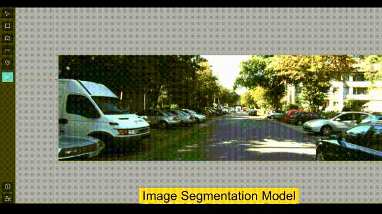
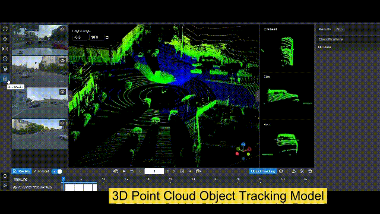
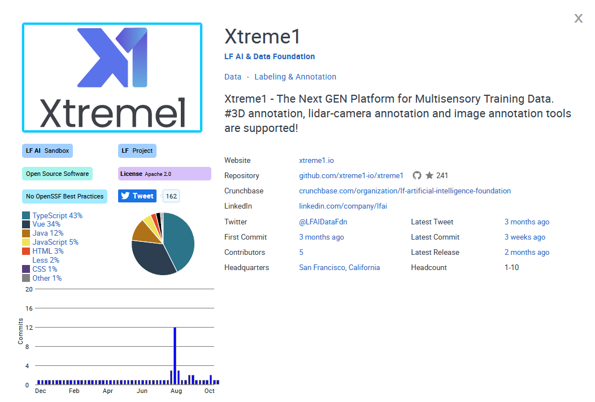

# 👋 Welcome to Xtreme1


Find our repos at [https://github.com/xtreme1-io/xtreme1](https://github.com/xtreme1-io/xtreme1)****


## Overview

### Introduction

Xtreme1 is the world's first open-source platform for **multisensory training data**.

Xtreme1 provides deep insight into data annotation, data curation, and ontology management to solve 2D image and 3D point cloud dataset ML challenges.

The built-in AI-assisted tools take your annotation efforts to the next level of efficiency for your **2D/3D Object Detection**, **3D Instance Segmentation**, and **LiDAR-Camera Fusion projects**.


### Getting Started

You can install Xtreme1 on a Linux, Windows, or MacOSX machine.

[**Prerequisites details and built-in models installation is explained here**](Docker-image/)

Get started from the [**Quick Start**](getting-started/Quick-start/):

```bash
wget https://github.com/xtreme1-io/xtreme1/releases/download/v0.5.2/xtreme1-v0.5.2.zip
unzip -d xtreme1-v0.5.2 xtreme1-v0.5.2.zip

docker compose up
```

Give us a :star: on [GitHub repo](https://github.com/xtreme1-io/xtreme1).


### Key features

| Image Bounding-box Annotation - [YOLOR](https://github.com/WongKinYiu/yolor) | Image Segmentation Annotation - [RITM](https://github.com/saic-vul/ritm\_interactive\_segmentation) |
| :--------------------------------------------------------------------------: | :-------------------------------------------------------------------------------------------------: |
|                                     |                                                                |

:one: Supports data labeling for images :camera:, 3D LiDAR and 2D/3D Sensor Fusion datasets :oncoming\_automobile: :vertical\_traffic\_light: :no\_pedestrians:

:two: Built-in pre-labeling and interactive models support 2D/3D object detection, segmentation and classification :rocket:

:three: Configurable Ontology Center for general classes (with hierarchies) and attributes for use in your model training :bookmark:

:four: Data management and quality monitoring :books:

:five: Find and fix labeling errors :microscope:

:six: Results visualization to help you to evaluate your model :chart\_with\_upwards\_trend:

| 3D Point Cloud Cuboid Annotation - [OpenPCDet](https://github.com/open-mmlab/OpenPCDet) | 2D & 3D Fusion Object Tracking Annotation - [AB3DMOT](https://github.com/xinshuoweng/AB3DMOT) |
| :-------------------------------------------------------------------------------------: | :-------------------------------------------------------------------------------------------: |
|                                                   |                                                        |

### Support

Join our community to chat with other members.

Slack: [https://xtreme1io.slack.com](https://join.slack.com/t/xtreme1group/shared\_invite/zt-1jhk36uzr-NpdpYXeQAEHN6rYJy5\_6pg)

Issue: [https://github.com/basicai/xtreme1/issues](https://github.com/basicai/xtreme1/issues)

GitHub: [https://github.com/basicai/xtreme1](https://github.com/basicai/xtreme1)

Twitter: [https://twitter.com/Xtreme1io](https://twitter.com/Xtreme1io)

Subscribe to the latest video tutorials on our [YouTube](https://www.youtube.com/@xtreme1ai) channel


> It is now hosted in [LF AI & Data Foundation](https://lfaidata.foundation/) as a sandbox project.

<figure><figcaption><p>LF AI &#x26; Data Foundation Interactive Landscape</p></figcaption></figure>

> The Mailchimp Marketing API provides programmatic access to Mailchimp data and functionality, allowing developers to build custom features to do things like sync email activity and campaign analytics with their database, manage audiences and campaigns, and more.
>
> — From the [Mailchimp Marketing API docs](https://mailchimp.com/developer/marketing/docs/fundamentals/)

## Quick links


[what-we-do.md](overview/what-we-do.md)



[our-features.md](overview/our-features.md)


## Get Started

We've put together some helpful guides for you to get setup with our product quickly and easily.


[getting-set-up](fundamentals/getting-set-up/)



[setting-permissions.md](fundamentals/getting-set-up/setting-permissions.md)



[inviting-members.md](fundamentals/getting-set-up/inviting-members.md)

