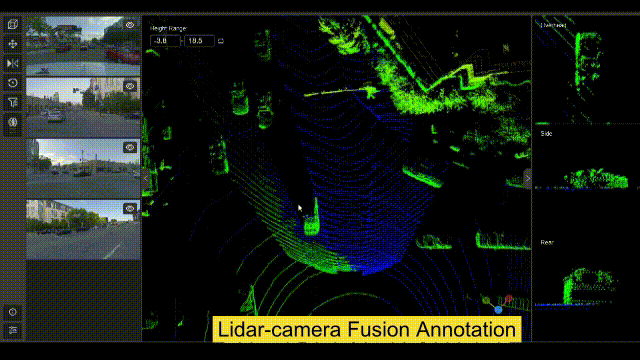

# Introduction


Xtreme1 is the world's first open-source platform for **multisensory training data**.

Xtreme1 provides deep insight into data annotation, data curation, and ontology management to solve 2D image and 3D point cloud dataset ML challenges. 

The built-in AI-assisted tools take your annotation efforts to the next level of efficiency for your **2D/3D Object Detection**, **3D Instance Segmentation**, and **LiDAR-Camera Fusion projects**.


## Getting Started


You can install Xtreme1 on a Linux, Windows, or MacOSX machine.

**[Prerequisites details and built-in models installation is explained here](./Docker-image)**

Get started from the **[Quick Start](./getting-started/Quick-start)**:
```bash
wget https://github.com/basicai/xtreme1/releases/download/v0.5.2/xtreme1-v0.5.2.zip
unzip -d xtreme1-v0.5.2 xtreme1-v0.5.2.zip

docker compose up
```

And Give us a :star: on [GitHub repo](https://github.com/basicai/xtreme1).

### Main features
 
# Key features #

Image Bounding-box Annotation - [YOLOR](https://github.com/WongKinYiu/yolor) |  Image Segmentation Annotation - [RITM](https://github.com/saic-vul/ritm_interactive_segmentation)
:-------------------------:|:-------------------------:
  |  

 :one: Supports data labeling for images :camera:, 3D LiDAR and 2D/3D Sensor Fusion datasets :oncoming_automobile: :vertical_traffic_light: :no_pedestrians:
 
 :two: Built-in pre-labeling and interactive models support 2D/3D object detection, segmentation and classification :rocket:
 
 :three: Configurable Ontology Center for general classes (with hierarchies) and attributes for use in your model training :bookmark:

 :four: Data management and quality monitoring :books:
 
 :five: Find and fix labeling errors :microscope:

 :six: Results visualization to help you to evaluate your model :chart_with_upwards_trend:


3D Point Cloud Cuboid Annotation - [OpenPCDet](https://github.com/open-mmlab/OpenPCDet) |  2D & 3D Fusion Object Tracking Annotation - [AB3DMOT](https://github.com/xinshuoweng/AB3DMOT)
:-------------------------:|:-------------------------:
  |  


## Support

Join our community to chat with other members.

Slack: [https://xtreme1io.slack.com](https://join.slack.com/t/xtreme1group/shared_invite/zt-1jhk36uzr-NpdpYXeQAEHN6rYJy5_6pg)

Issue: https://github.com/basicai/xtreme1/issues

Github: https://github.com/basicai/xtreme1

Twitter: https://twitter.com/xxxxx

Subscribe to the latest video tutorials on our [YouTube](https://www.youtube.com/@xtreme1ai) channel
