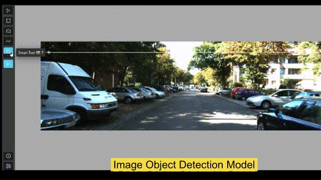

# 👋 Welcome to Xtreme1


Find our repos at [https://github.com/xtreme1-io/xtreme1](https://github.com/xtreme1-io/xtreme1)****


## Introduction

Xtreme1 is the world's first open-source platform for **multisensory training data**.

Xtreme1 provides deep insight into data annotation, data curation, and ontology management to solve 2D image and 3D point cloud dataset ML challenges.

The built-in AI-assisted tools take your annotation efforts to the next level of efficiency for your **2D/3D Object Detection**, **3D Instance Segmentation**, and **LiDAR-Camera Fusion projectsF**

## Getting Started

You can install Xtreme1 on a Linux, Windows, or MacOSX machine.

[**Prerequisites details and built-in models installation is explained here**](Docker-image/)**.**

Get started from the [**Quick Start**](overview/what-we-do.md):

```bash
wget https://github.com/xtreme1-io/xtreme1/releases/download/v0.5.2/xtreme1-v0.5.2.zip
unzip -d xtreme1-v0.5.2 xtreme1-v0.5.2.zip

docker compose up
```

## Key Features

| Image Bounding-box Annotation - [YOLOR](https://github.com/WongKinYiu/yolor) | Image Segmentation Annotation - [RITM](https://github.com/saic-vul/ritm\_interactive\_segmentation) |
| :--------------------------------------------------------------------------: | :-------------------------------------------------------------------------------------------------: |
|                                     |                                                                |

:one: Supports data labeling for images :camera:, 3D LiDAR and 2D/3D Sensor Fusion datasets :oncoming\_automobile: :vertical\_traffic\_light: :no\_pedestrians:

:two: Built-in pre-labeling and interactive models support 2D/3D object detection, segmentation and classification :rocket:

:three: Configurable Ontology Center for general classes (with hierarchies) and attributes for use in your model training :bookmark:

:four: Data management and quality monitoring :books:

:five: Find and fix labeling errors :microscope:

:six: Results visualization to help you to evaluate your model :chart\_with\_upwards\_trend:

| 3D Point Cloud Cuboid Annotation - [OpenPCDet](https://github.com/open-mmlab/OpenPCDet) | 2D & 3D Fusion Object Tracking Annotation - [AB3DMOT](https://github.com/xinshuoweng/AB3DMOT) |
| :-------------------------------------------------------------------------------------: | :-------------------------------------------------------------------------------------------: |
|                                                   |                                                        |


It is now hosted in [LF AI & Data Foundation](https://lfaidata.foundation/) as a sandbox project.


<figure><figcaption><p>Xtreme1, the First Open-Source Labeling &#x26; Annotation and Visualization Project, is debuting at the Linux Foundation AI &#x26; DATA Global Landscape</p></figcaption></figure>

## Support

Join our community to chat with other members.

Slack: [https://xtreme1io.slack.com](https://join.slack.com/t/xtreme1group/shared\_invite/zt-1jhk36uzr-NpdpYXeQAEHN6rYJy5\_6pg)

Issue: [https://github.com/basicai/xtreme1/issues](https://github.com/basicai/xtreme1/issues)

Medium: [https://medium.com/multisensory-data-training](https://medium.com/multisensory-data-training)

GitHub: [https://github.com/basicai/xtreme1](https://github.com/basicai/xtreme1)

Twitter: [https://twitter.com/Xtreme1io](https://twitter.com/Xtreme1io)

Subscribe to the latest video tutorials on our [YouTube](https://www.youtube.com/@xtreme1ai) channel


## Quick links


[what-we-do.md](overview/what-we-do.md)



[Broken link](broken-reference)


## Get Started

We've put together some helpful guides for you to get setup with our product quickly and easily.


[Broken link](broken-reference)



[Broken link](broken-reference)



[Broken link](broken-reference)

