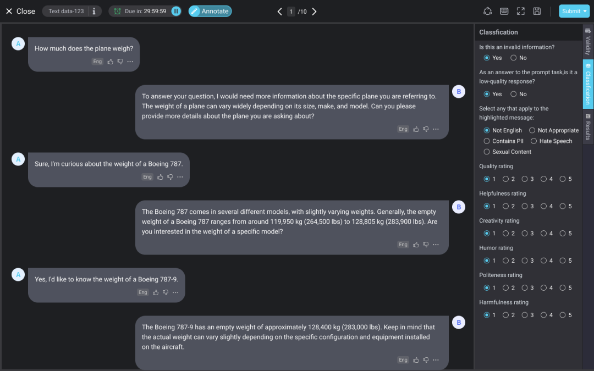

# V 0.7.0

Release v0.7.0 (April 28 2023)

## What's new?

LLM Text Annotation is the process of identifying and labeling the different elements or components in a natural language text, such as named entities (e.g. person names, locations), part-of-speech tags, sentiment polarity and other key features that could help in analyzing and processing the text.

### **Text annotation for LLM**

* Add new data category - Text is support;
* Allow user to upload text datasets;
* New thumbnails and UI styles;
* Support to import and export data in the required format

<figure><figcaption><p>Text annotation interface with Xtreme1 v0.7.0</p></figcaption></figure>

* Sample dataset:&#x20;

```json
[
{ "id": "6f1d0711", "parentId": null, "text": "Hi!", "role": "prompter" }
,js
{ "id": "4a24530b", "parentId": "6f1d0711", "text": "Hello! How can I help you?", "role": "assistant" }
,
{ "id": "a8c01c04", "parentId": "4a24530b", "text": "Do you have a recipe for potato soup?", "role": "prompter"   }
,
{ "id": "f43a93b7", "parentId": "4a24530b", "text": "Who were the 8 presidents before George Washington?", "role": "prompter" }
,
{ "id": "c886920", "parentId": "6f1d0711", "text": "Hey buddy! How can I serve you?", "role": "assistant" }
,
{ "id": "cec432cf", "parentId": null, "text": "euirdteunvglfe23908230892309832098 AAAAAAAA", "role": "prompter" }
,
{ "id": "4f85f637", "parentId": "cec432cf", "text": "Sorry, I did not understand your request and it is unclear to me what you want me to do. Could you describe it in a different way?", "role": "assistant" }
,
{ "id": "0e276b98", "parentId": "cec432cf", "text": "I'm unsure how to interpret this. Is it a riddle?", "role": "assistant" }
,
{ "id": "89384709", "parentId": "0e276b98", "text": "No, I just wanted to see how you reply when I type random characters. Can you tell me who invented Wikipedia?", "role": "prompter" }
,
{ "id": "6d452c57", "parentId": "0e276b98", "text": "Sorry, my cat sat on my keyboard. Can you print a cat in ASCII art?", "role": "prompter" }
]
  
```

```
LLM text annotation dataset structure
├── test
│   ├── 00.json
```

This is still an early version of text annotation for LLM.
