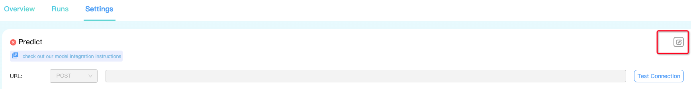

# 🪄 Model Integration Guide

## Model Service Interface

### Request

**POST**

&#x20;`http://ip:port/pointCloud/recognition`

**Parameters**

```python
{
 # A request can contain multiple pieces of data
     "datas": [
     # Each frame of data contains one point cloud file
     {
         "id": 1, # UUID
         "pointCloudUrl": "https://path/to/000001.pcd", # url of the point cloud file
         "imageUrls": [
             "https://path/to/image0/000001.jpg",
             ...
         ],
         "cameraConfigUrl": "https://path/to/camera_config/000001.json"
         }
     ]
}
```

#### Responses

```python
{
     "code": "OK",
     "message": "",
     "data": [
         {
             "id": 1, # UUID from request
             "code": "OK",
             "message": "",
             "objects": [
                 {
                     "label": "CAR", # class
                     "confidence": 0.7 # Confidence: (0~1)
                    
                     "x": 0.0, "y": 0.0, "z": 0.0, # The position of the center point of the box
                     "dx": 3, "dy": 2, "dz": 1.5, # size of the box
                     "rotX": 0, "rotY": 0, "rotZ": 0.5, # The rotation direction of the box (Euler angle XYZ, intrinsic rotations)
                 }
             ],
             "confidence": 0.8 # Confidence of the whole data (optional)
         }
     ]
}
```

## Development Services

### Point Cloud Object Detection Service

Write a service script

An example: `pcdet_demo_service.py`

```python
from flask import Flask, request, jsonify

app = Flask(__name__)

def predict(pcd_url):
     # 1. Download the pcd file from the pcd_url file (make sure the algorithm service is connected to the Xtreme1 service machine)
     # r = requests. get(pcd_url, allow_redirects=True)
     # 2. Load the pcd file and get the point cloud information
     # pcd_file = io.BytesIO(r.content)
     #pc = load_pcd(pcd_file)
     # 3. Predict and get the result of target detection
     # results = object_detection(pc)
     return [
         # return a detection example
         {
             "label": "CAR", # category
             "confidence": 0.7, # Confidence: (0~1)
            
             "x": 0.0, "y": 0.0, "z": 0.0, # the position of the center point of the box
             "dx": 3, "dy": 2, "dz": 1.5, # size of the box
             "rotX": 0, "rotY": 0, "rotZ": 0.5, # The rotation direction of the box (Euler angle XYZ, intrinsic rotations)
         }
     ]

@app.route("/pointCloud/recognition", methods = ['POST'])
def recognition():
     datas = request.json['datas']

     result = {
         "code": "OK",
         "message": "",
         "data": [
             {
                 "id": data['id'],
                 "code": 0,
                 "message": "",
                 "objects": predict(data['pointCloudUrl'])
             }
             for data in data
         ]
     }
     return jsonify(result)y
```

### Integration Services

#### Start Service

```shell
Shell
# flask 2.2.3
flask --app=pcdet_demo_service run --host=0.0.0.0 --port=5000
```

#### Testing Service

```sh
Shell
curl -X POST http://<ip>:<port>/pointCloud/recognition -H "Content-Type: application/json"  -d '{"datas": [{"id":1, "pointCloudUrl":"http://test"}]}'
```


Note: replace _\<ip>_ and _\<port>_


#### Integration Services

* Log into Xtreme1 platform;
* Enter `Models/Create My Model`, select `Data Type` as `Lidar`, and click the `Save` button to create the model;
* Click the newly created model to enter the details page, and click `Settings` in the panel;

<figure><figcaption><p>Click the <code>Edit</code> button in the upper right corner</p></figcaption></figure>

* Fill in the service address in the URL edit box:

`http://<ip>:<port>pointCloud/recognition`


Note: You need to ensure that the machine where the Xtreme1 service is deployed can access this address.


* Click the `Test Connection` button, if successful, it will return the correct response.

```json
{
  "code": "OK",
  "message": "",
  "data": [
    {
      "code": 0,
      "id": 3091721,
      "message": "",
      "objects": [{...}]
    }
  ]
```


