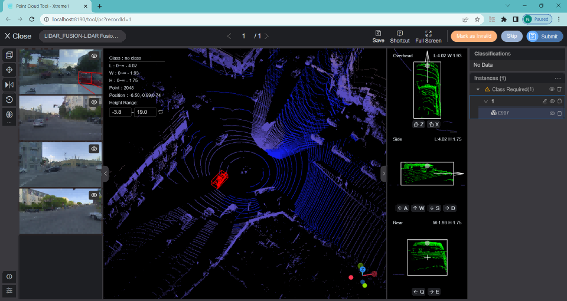

# ⚡ Quick Start

You have just learned the **basics of Xtreme1** and now it is the time to install it. Standard Docker image installation enables all major features of Xtreme1 and is the recommended installation for the most users.

### System requirements <a href="#system-requirements" id="system-requirements"></a>

You can install Xtreme1 on a Linux, Windows, or MacOSX machine.​​

[**Prerequisites details and built-in models installation is explained here**](../overview/what-we-do.md#operating-system-requirements)

### Download package <a href="#download-package" id="download-package"></a>

Download the latest release package (v0.7.1 is the latest version) and unzip it. Or using the following command:

```bash
wget https://github.com/xtreme1-io/xtreme1/releases/download/v0.7.1/xtreme1-v0.7.1.zip
unzip -d xtreme1-v0.7.1 xtreme1-v0.7.1.zip
```

### Start all services <a href="#start-all-services" id="start-all-services"></a>

Enter into the release package directory, and execute the following command to start all services. It needs a few minutes to initialize database and prepare a test dataset.

If everything shows OK in the console, you can visit `http://localhost:8190`in your browser (Google Chrome is recommended) to try out Xtreme1. You can replace localhost to IP address if you want to access from another computer.

```bash
docker compose up
```

<figure><figcaption><p>3D Point Cloud Annotation Interface</p></figcaption></figure>

## Install built-in models


```bash
#  You need to explicitly specify a model profile to enable model services
docker compose --profile model up
```


[See more details about models installation.](../getting-started/Docker-image/)


If you face additional issues, [please let us know.](https://github.com/xtreme1-io/xtreme1/issues)
