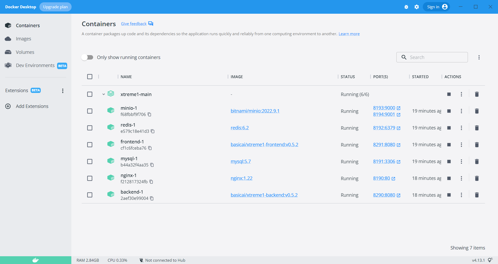

# Install with Docker

Xtreme1 can be installed via Docker. 

Make sure you have [Docker](https://www.docker.com/) installed on your machine.

It is recommended to use the latest version.

## Prerequisites

### Operating System Requirements

Any OS can install the Xtreme1 platform with Docker Compose (installing [Docker Desktop](https://docs.docker.com/desktop/) on Mac, Windows, and Linux devices). On the Linux server, you can install Docker Engine with [Docker Compose Plugin](https://docs.docker.com/compose/install/linux/).

#### Hardware Requirements

| Component  | Recommended configuration |
| ------------- | ------------- |
| CPU | AMD64 or ARM64 |
| RAM | 2GB or higher |
| Hard Drive | 10GB+ free disk space (depends on data size) |

#### Software Requirements

For Mac, Windows, and Linux with desktop:

| Software | Version |
| ------------- | ------------- |
| Docker Desktop | 4.1 or newer |

For Linux server:

| Software | Version |
| ------------- | ------------- |
| Docker Engine | 20.10 or newer |
| Docker Compose Plugin | 2.0 or newer |


#### :warning: (Built-in) Models Deployment Requirements

Two built-in models only can be running on Linux server with [NVIDIA Driver](https://docs.nvidia.com/datacenter/tesla/tesla-installation-notes/index.html) and [NVIDIA Container Toolkit](https://docs.nvidia.com/datacenter/cloud-native/container-toolkit/install-guide.html#docker).

| Component | Recommended configuration |
| ------------- | ------------- |
| GPU | Nvidia Tesla T4 or other similar Nvidia GPU  |
| GPU RAM | 6G or higher |
| RAM | 4G or higher |


## Download package

Download the latest release package and unzip it. 

Or using the following command:

```bash
wget https://github.com/basicai/xtreme1/releases/download/v0.5.2/xtreme1-v0.5.2.zip
unzip -d xtreme1-v0.5.2 xtreme1-v0.5.2.zip
```

## Start all services

Enter into the release package directory, and execute the following command to start all services. It needs a few minutes to init database and prepare a test dataset.

```bash
docker compose up
```

Visit [http://localhost:8190](http://localhost:8190) in the browser (Google Chrome is recommended) to try out Xtreme1!

You can replace `localhost` with IP address if you want to access from another machine.




### Docker Compose advanced commands

```bash
# Start in foreground.
docker compose up

# Or add -d option to run in background.
docker compose up -d

# When up finished, you can start or stop all or specific service.
docker compose start
docker compose stop

# Stop all services and delete all containers, but data volumes will be kept.
docker compose down

# Delete volumes together, you will lose all your data in mysql, redis and minio, be careful!
docker compose down -v
```

Docker compose will pull all service images from Docker Hub, including basic services `mysql`, `redis`, `minio`, and application services `backend`, `frontend`. You can find the username, password, hot binding port to access MySQL, Redis and MinIO in `docker-compose.yml`, for example you can access MinIO console at `http://localhost:8194`. We use Docker volume to save data, so you won't lose any data between container recreating.

### Enable model services

> Make sure you have installed [NVIDIA Driver](https://docs.nvidia.com/datacenter/tesla/tesla-installation-notes/index.html) and [NVIDIA Container Toolkit](https://docs.nvidia.com/datacenter/cloud-native/container-toolkit/install-guide.html#docker). But you do not need to install the CUDA Toolkit, as it already contained in the model image.

```bash
# You need set "default-runtime" as "nvidia" in /etc/docker/daemon.json and restart docker to enable NVIDIA Container Toolkit
{
  "runtimes": {
    "nvidia": {
      "path": "nvidia-container-runtime",
      "runtimeArgs": []
    }
  },
  "default-runtime": "nvidia"
}

```

```bash
# You need to explicitly specify model profile to enable model services.
docker compose --profile model up
```


If you face additional issues, [please let us know.](https://github.com/basicai/xtreme1/issues)