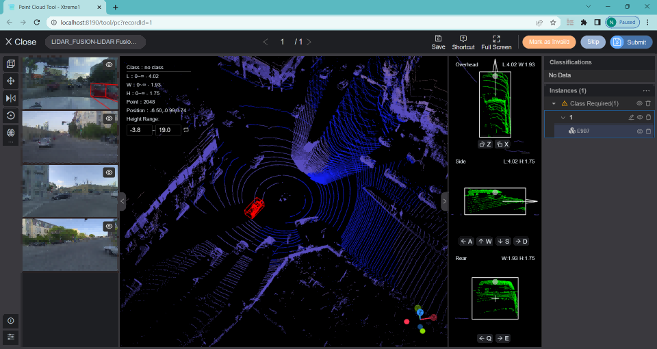

# Quick Start

You have just learned the **basics of Xtreme1** and now it is the time to install it.

Standard Docker image installation enables all major features of Xtreme1 and is the recommended installation for most users.

### System requirements

You can install Xtreme1 on a Linux, Windows, or MacOSX machine.

**[Prerequisites details and built-in models installation is explained here](./Docker-image)**


## Download package

Download the latest release package （v0.5.2 is the latest version） and unzip it. 

Or using the following command:

```bash
wget https://github.com/basicai/xtreme1/releases/download/v0.5.2/xtreme1-v0.5.2.zip
unzip -d xtreme1-v0.5.2 xtreme1-v0.5.2.zip
```

## Start all services

Enter into the release package directory, and execute the following command to start all services. It needs a few minutes to init database and prepare a test dataset.

```bash
docker compose up
```

Visit [http://localhost:8190](http://localhost:8190) in the browser (Google Chrome is recommended) to try out Xtreme1!

You can replace `localhost` with IP address if you want to access from another machine.




## Install built-in models

```bash
# You need to explicitly specify model profile to enable model services.
docker compose --profile model up
```

[See more details about models installation.](./Docker-image)

If you face additional issues, [please let us know.](https://github.com/basicai/xtreme1/issues)