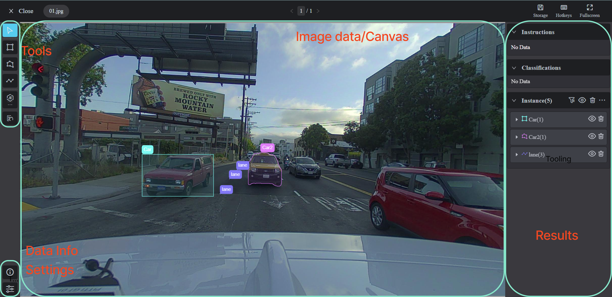
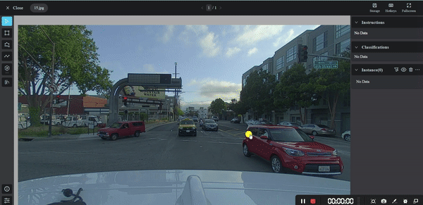
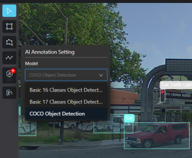
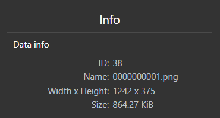

# 🖼 Image Annotation Tool

## Image Annotation Overview

The interface of **Image Annotation** includes Tool, Image data/Canvas, Result, Data info and Settings area, which is straightforward.

<figure><figcaption>
Image Annotation Tool Interface
</figcaption></figure>

### Start to Annotate

Select the annotation types (bounding box, polygon and polyline) from the left tool bar that you need and draw on the canvas, then select the class and the attribute.

### Run the Model to Predict

Xtreme1 Image Annotation Tool is integrated with various models for different use cases.

Easily run a model prediction by one-click and results will be generated on the image.

<figure><figcaption>
AI-assisted Pre-labeling of Autonomous Driving Datasets
</figcaption></figure>

All available models can be chosen from the list.

<figure><figcaption></figcaption></figure>

### Run the Interactive Model

Select the interactive model (for segmentation) and create a bounding box to the object then a polygon that fits the recognized object will be created by the AI model.

<figure><figcaption>
Interactive AI Model for Image Segmentation
</figcaption></figure>

### Data Info

Click Info icon to view data information. Data ID, data name, dimension and file size can be found.

<figure><figcaption></figcaption></figure>

### Settings

In Settings, some parameters can help you on the annotation process by adjusting values or switching options from brightness, contrast, opacity, auxiliary lines or display modes.

### Shortcut List

|               Key               |         Key        |
| :-----------------------------: | :----------------: |
|          **About Data**         |  **Shortcut key**  |
|             Previous            |       Page Up      |
|               Next              |      Page Down     |
|                                 |                    |
|        **About Instance**       |  **Shortcut key**  |
|               Save              |     Ctrl/⌘ + S     |
|              Cancel             |         Esc        |
|      Delete instance/ point     |       Delete       |
|          Finish drawing         |        Enter       |
|        Show/hide tag pad        |          T         |
|    Move upper side out by 1px   |     Ctrl/⌘ + ↑     |
|   Move bottom side out by 1px   |     Ctrl/⌘ + ↓     |
|    Move left side out by 1px    |     Ctrl/⌘ + ←     |
|    Move right side out by 1px   |     Ctrl/⌘ + →     |
|   Move upper side out by 10px   | Ctrl/⌘ + Shift + ↑ |
|   Move bottom side out by 10px  | Ctrl/⌘ + Shift + ↓ |
|    Move left side out by 10px   | Ctrl/⌘ + Shift + ← |
|   Move right side out by 10px   | Ctrl/⌘ + Shift + → |
|               Undo              |     Ctrl/⌘ + Z     |
|               Redo              | Ctrl/⌘ + Shift + Z |
| Crop1 Do not crop the first one |          X         |
|     Crop2 Crop the first one    |      Ctrl + X      |
|                                 |                    |
|          **About Tool**         |  **Shortcut key**  |
|              Select             |          2         |
|        Bounding box tool        |          3         |
|           Polygon tool          |          4         |
|          Polyline tool          |          5         |
|            Smart Tool           |          7         |
|         Interactive tool        |          8         |
|                                 |                    |
|         **About Image**         |  **Shortcut key**  |
|        Zoom in, Zoom Out        |        Wheel       |
|               Drag              | Space + Left click |
|          Cancel window          |         Esc        |

