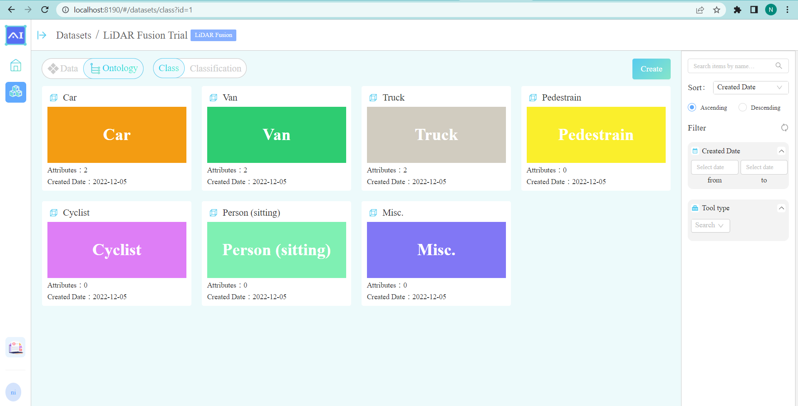
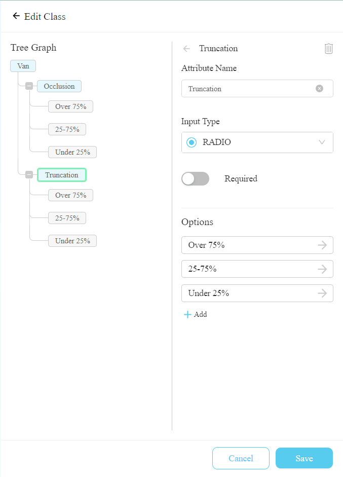
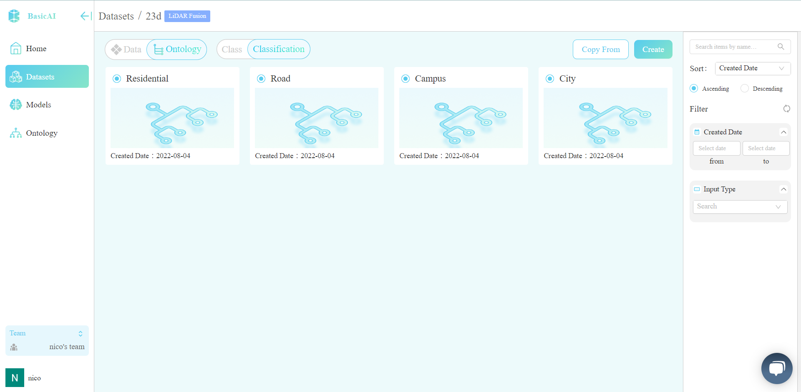

# 🏷 Ontology

##

## Overview

Xtreme1 ontology provides preset general classes (hierarchies) and attributes for use in your model training. You can also build a customized one from the very beginning. The ontology configuration page can be found in Dataset -> Ontology.&#x20;

A custom ontology can be set for each dataset. In the outermost layer, there will also be many preset templates (in advanced features) that can be applied by different use cases. These features will greatly improve your data management efficiency when you are working on the model training across datasets.

<figure><figcaption></figcaption></figure>

## Create a Class

A class is used for bounding box/polygon/polyline/etc. tools.

<figure><figcaption>
Create a Class in Ontology
</figcaption></figure>

* In object detection, we usually use **a bounding box** to describe the spatial location of an object. The bounding box is rectangular, which is determined by the x and y coordinates of the upper-left corner of the rectangle and the such coordinates of the lower-right corner. Another commonly used bounding box representation is the (x,y)-axis coordinates of the bounding box center, and the width and height of the box.
* **The polygons** are used in two important tasks in the field of computer vision that are similar to semantic segmentation, namely image segmentation and instance segmentation.
* **The polyline** tool is used to define linear structures in images and video.

## Create a Classification

**The Classification** enables annotating on data such as an image or a point cloud file. For instance, classification can be used to classify product images under categories, subcategories, and characteristics, such as “City/Residential/Campus” area, etc.

<figure><figcaption>
Create a Classification in Ontology
</figcaption></figure>

This ontology setting example is created according to the [KITTI Dataset](https://www.cvlibs.net/datasets/kitti/).
