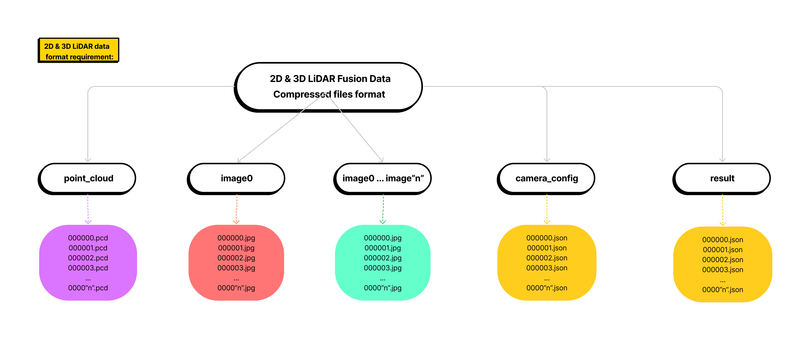

# ⛽ Upload Dataset

## Dataset Format

Datasets can be uploaded from the `local drive` and through`URLs`.

### **Image**

| Images data format requirement | <p>Image files in .jpg and .png are supported.<br></p><p>Compressed files (in .zip, .gzip, .tar format) can also be uploaded directly..</p> |
| ------------------------------ | ------------------------------------------------------------------------------------------------------------------------------------------- |

The image dataset sample can be downloaded from [_here_](https://app.box.com/s/hskeiv45ie1q3l6wubte6vaphreh76z3).

> _This dataset is provided by_ [_PandaSet_](https://pandaset.org/) _- a high-quality open-source dataset for autonomous driving._

If you don’t see a supported data or file type that you want to upload, Join our [Slack community](https://join.slack.com/t/xtreme1io/shared\_invite/zt-1jhk36uzr-NpdpYXeQAEHN6rYJy5\_6pg).

<figure><figcaption></figcaption></figure>

### **LiDAR (Point Cloud)**

LiDAR dataset folder must be compressed and placed under the folder "**point\_cloud**" and data must be in **.pcd** format.

<table data-header-hidden><thead><tr><th width="295"></th><th></th></tr></thead><tbody><tr><td>LiDAR data format requirement</td><td><p>Folder name: <strong>point_cloud</strong></p><p>File format: <strong>.pcd</strong></p><p>Upload file: compressed files <strong>(</strong>in <strong>.zip, .gzip, .tar</strong> format<strong>)</strong></p></td></tr></tbody></table>

The LiDAR dataset sample can be downloaded from [_here_](https://app.box.com/s/quxqvns8vzhi2w0kt8iladg0nbqp8s1l).

> _This dataset is provided by_ [_PandaSet_](https://pandaset.org/) _- a high-quality open-source dataset for autonomous driving._

If you don’t see a supported data or file type that you want to upload, Join our [Slack community](https://join.slack.com/t/xtreme1io/shared\_invite/zt-1jhk36uzr-NpdpYXeQAEHN6rYJy5\_6pg).

### **2D & 3D LiDAR Fusion**

2D & 3D LiDAR fusion dataset format requirement:

<table data-header-hidden><thead><tr><th width="188"></th><th></th></tr></thead><tbody><tr><td>Folder structure</td><td><p><strong>point_cloud</strong>: LiDAR data folder name</p><p><strong>camera_config</strong>: camera parameter files folder name </p><p><strong>image0</strong>: 1st set of image data folder name</p><p><strong>image1</strong>: 2nd set of image data folder name<strong>image2</strong>: 3rd set of image data folder name...<strong>imageN</strong>: Nth set of image data folder name</p></td></tr><tr><td>File format</td><td><p>LiDAR file format: <strong>.pcd</strong></p><p>Image file format: <strong>.jpg</strong> and <strong>.png</strong></p><p>Camera parameter file format: <strong>.json</strong></p><p>Upload file: compressed files in <strong>.zip, .gzip, .tar</strong> format</p></td></tr></tbody></table>

All same set data must be placed in different folders with the identical file name.

<figure><figcaption><p>Folder Structure Diagram</p></figcaption></figure>

The 2D & 3D LiDAR Fusion dataset sample can be downloaded from [_here_](https://app.box.com/s/iuwytq16vakhiy6dlh3uxe4s65s03qu6).

<figure><figcaption><p>2D &#x26; 3D Fusion Dataset Example</p></figcaption></figure>

> _This dataset is provided by_ [_PandaSet_](https://pandaset.org/) _- a high-quality open-source dataset for autonomous driving._

### **Structure**

2D & 3D LiDAR Fusion dataset

```
2D & 3D LiDAR Fusion dataset structure

├── point_cloud
│   ├── 00.pcd
│   ├── 01.pcd
│   ├── 02.pcd
├── image0
│   ├── 00.png
│   ├── 01.png
│   ├── 02.png
├── image1
│   ├── 00.png
│   ├── 01.png
│   ├── 02.png
├── image2
│   ├── 00.png
│   ├── 01.png
│   ├── 02.png
├── camera_config
│   ├── 00.json
│   ├── 01.json
│   ├── 02.json
├── result
│   ├── 00.json
│   ├── 01.json
│   ├── 02.json
```

### **Upload dataset with pre-annotation results**

LiDAR basic and 2D & 3D LiDAR Fusion support to upload dataset with pre-annotation results.

All json files must be placed under the`result` folder.

<figure><figcaption><p>Dataset Folder Names</p></figcaption></figure>

## Tutorial


Tutorial Series: Upload Multisensory Data


### **Dataset License**

This dataset is provided by [PandaSet](https://pandaset.org/) - a high-quality open-source dataset for autonomous driving. These Datasets are provided to You under a Creative Commons Attribution 4.0 International Public License (“CC BY 4.0”).
