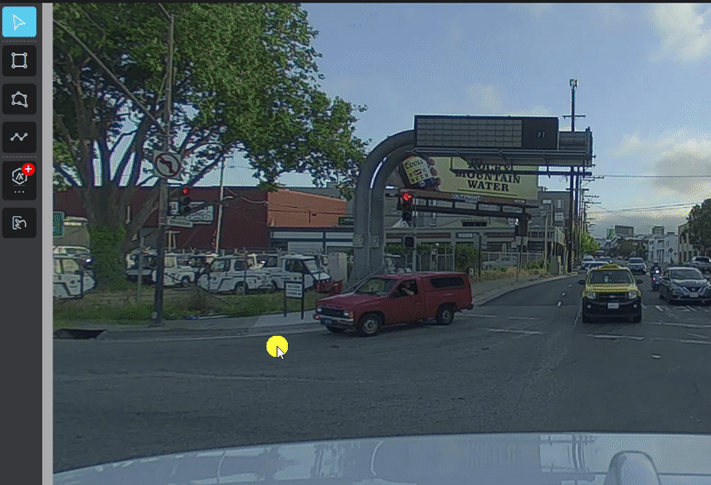

# Image Annotation Tool

Using digital images from cameras and videos and deep learning models, machines can accurately identify and classify objects — and then react to what they see.

## Image Annotation Overview

The interface of **Image Annotation** includes Tool, Image data/Canvas, Result, Data info and Settings area, which is straightforward.

## Start to Annotate

Select the annotation types (bounding box, polygon and polyline) from the left tool bar that you need and draw on the canvas, then select the class and the attribute.

## Run the Model to Predict

Xtreme1 Image Annotation Tool is integrated with various models for different use cases.

Easily run a model prediction by one-click and results are generated on the image.

All available models can be chosen from the list. 

For model details and how to integrate with my or third-party's models, see Model page.

## Run the Interactive Model 

Select the interactive model (for segmentation) and create a bounding box to the object then a polygon that fits the recognized object will be created by the AI model .

## Data Info

Click Info icon to view data information. Data ID, data name, dimension and file size can be found.

## Settings

In Settings, some parameters can help you on the annotation process by adjusting values or switching options from brightness, contrast, opacity, auxiliary lines or display modes.

## Shortcut List

Key |  Description
:-------------------------:|:-------------------------:
**Data** | Shortcut key
Previous | Page Up
Next | Page Down
**Instance** | Shortcut key
Save  |  Ctrl/⌘ + S
Cancel | Esc
Delete instance/ point  |  Delete
Finish drawing | Enter
Show/hide tag pad | T
Move upper side out by 1px | Ctrl/⌘ + ↑
Move bottom side out by 1px | Ctrl/⌘ + ↓
Move left side out by 1px | Ctrl/⌘ + ←
Move right side out by 1px | Ctrl/⌘ + →
Move upper side out by 10px | Ctrl/⌘ + Shift + ↑
Move bottom side out by 10px | Ctrl/⌘ + Shift + ↓
Move left side out by 10px | Ctrl/⌘ + Shift + ←
Move right side out by 10px | Ctrl/⌘ + Shift + →
Undo | Ctrl/⌘ + Z
Redo | Ctrl/⌘ + Shift + Z
Crop1 Do not crop the first one | X
Crop2 Crop the first one | Ctrl + X
**Tool** | Shortcut key
Select | 2
Bounding box tool | 3
Polygon tool | 4
Polyline tool | 5
Smart Tool | 7
Interactive tool | 8
**Image** | Shortcut key
Zoom in, Zoom Out | Wheel
Drag | Space + Left click
Cancel window | Esc
