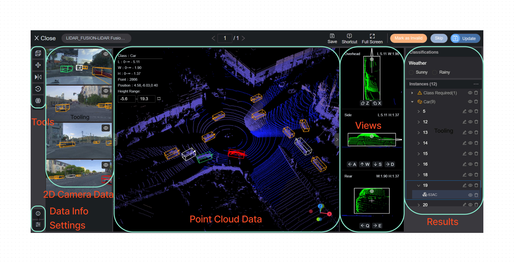
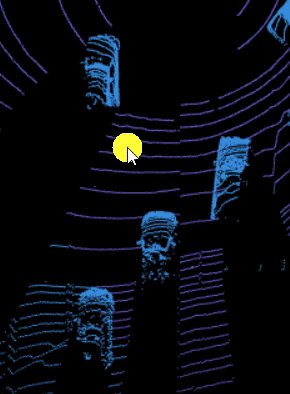
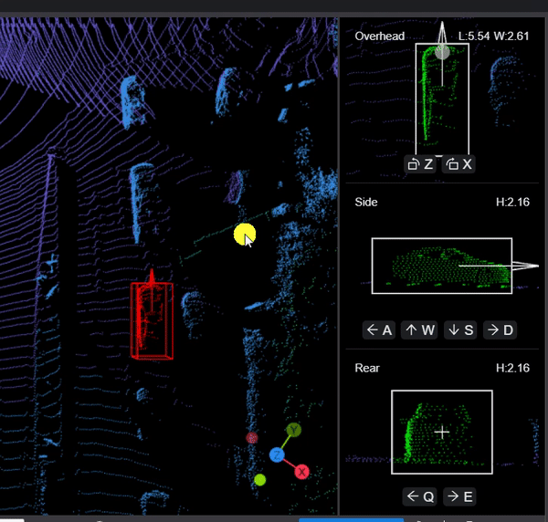
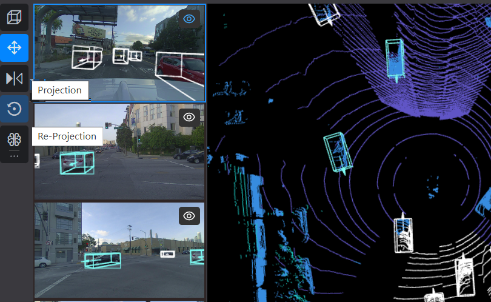
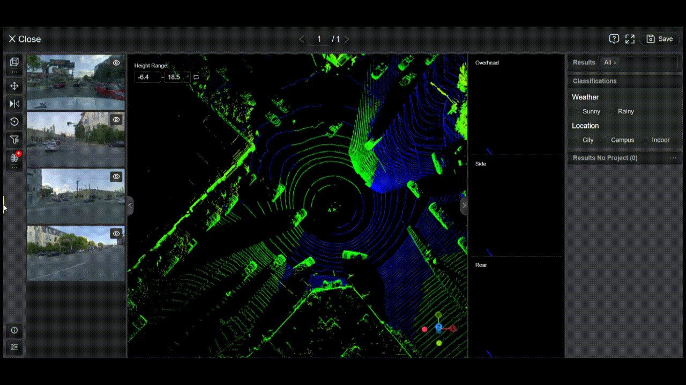
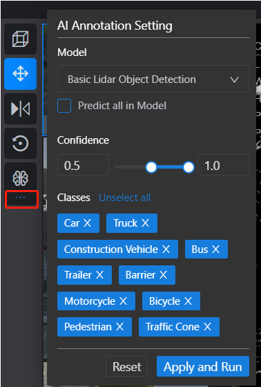

# LiDAR Annotation Tool

This article describes how to use 2D & 3D Fusion and Frame Series tool. Object tracking is a key-feature of the perception system of autonomous cars and ADASs.

## LiDAR Annotation Overview

The main screen of the LiDAR consists of the following parts

**Tools**
- to create and adjust cuboids;
- to project b-box/2d cuboid to 2D images;
- to run a model to predict results

**2D Camera Data**
- to project b-box/2d cuboid on 2d image;
- If it is not a 2D & 3D Fusion dataset, 2d images are used for reference, helping to identify objects that are not clear in 3D.

**Point Cloud Data**
- to annotate objects according the model training requirement;
- AI-assisted tool can precisely make the cuboid fit on the object

**Settings**
- There are many settings in s that can help annotators better identify objects. For example, by displaying the intensity value of points, changing the size of points, etc.

**Cuboid Views**
- When a cuboid is created on 3D point cloud data area, minor adjustments are usually made here to make the cuboid fit as closely as possible to the target object.

**Results**
- Annotated object results will be displayed here. The label can be found through filters.

**Data Info**
- to display the information of the dataset.

## Start to Annotate

Click **Create** (or hit F on keyboard) on the upper right corner, delineate the outline of the object, then a cuboid that fits the object will be generated by the AI-assisted tool.

## Adjust
In most cases, slightly adjust the cuboid in three different views: overhead, side and rear views.

Hit **C** on the keyboard to change the cuboid facing direction.

It is recommended to use shortcut keys to adjust the position.

Key | Check in 3 Views |Function
:-------------------------:|:-------------------------::|:-------------------------:
**Z X** | Check in Overhead view | Rotate Clockwise / Counterclockwise
**A W S D** | Check in Side view | Move to Left / Up/ Down/ Right
**Q E** | Check in Rear view 	 | Move to Left / Right
Note: Using shortcuts do not reset the scale of three views.

## Projection & Re-projection

If you're working on a 2D & 3D fusion dataset, Projection and Reprojection button can project a bounding box or cuboid to the RGB images from point cloud data.

You can adjust the bounding box and cuboid in RGB images, click Re-Projection to reset the result.

## AI Model Pre-annotation

Xtreme1 platform has preset models for ADAS scenarios -- only by clicking one button to auto-generate results. Yon can also integrate other models into the Xtreme1 platform. See Model Page.

Click **Run Model** button to apply a model to auto-annotate objects in 3D point cloud data. Click the button again to load results after recognition.

Running model predicts all targets in point cloud data by default, you can choose preferred classes and confidence value in AI Annotation Setting.

## Data Info

Click **Info** button on the lower left corner to show Coordinates, Points of selected scene results.

## Display Setting

Click **Setting** below data info to customize display effects of Image, Point cloud and Result etc.

1. Image: Tick checkboxes to show Cuboids, 3D Cuboids, Projected Cuboids and Projected Points

2. Point Cloud:
Points - Point size in 3D point cloud;
Color Height / Intensity - Slide or input value to modify point cloud render color;
Click **Reset** to reset to default value;

3. Objects：Switch to show tags on results;

4. Utility：Switch to show distance measure and its radius in meter

## Shortcuts list

Key |  Description
:-------------------------:|:-------------------------:
**Actions** | Shortcut key
F | Create Object
Ctrl/⌘ + C  | Copy Object
Ctrl/⌘ + V  | Paste Object
Ctrl/⌘ + Drag  | Copy by Drag Object
Del | Delete Object
Ctrl/⌘ + Z  | Undo
Ctrl/⌘ + Shift + Z  | Redo
U | Turn on/off Auto Fit
**Edit Cuboid** | Shortcut key
W/S  | Move Cuboid Up/Down
A/D  | Move Cuboid Backward/Forward
Q/E  | Move Cuboid Left/Right
Z/X  | Rotate Cuboid Clockwise / Counterclockwise
T  | Show/Hide Classes and Attributes Pad
M  | Show/Hide Label
C  | Change Head Direction
V  | Filp Head
**Display** | Shortcut key
G | Show/Hide Coordinate Axis
B | Filter Other Object in 2D View
N | Show/Hide Distance Measure
R | Open/Close Review Panel

