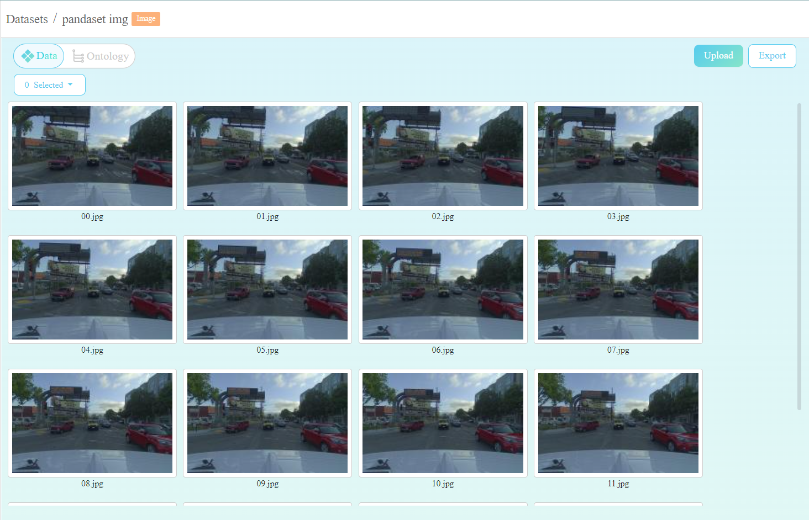
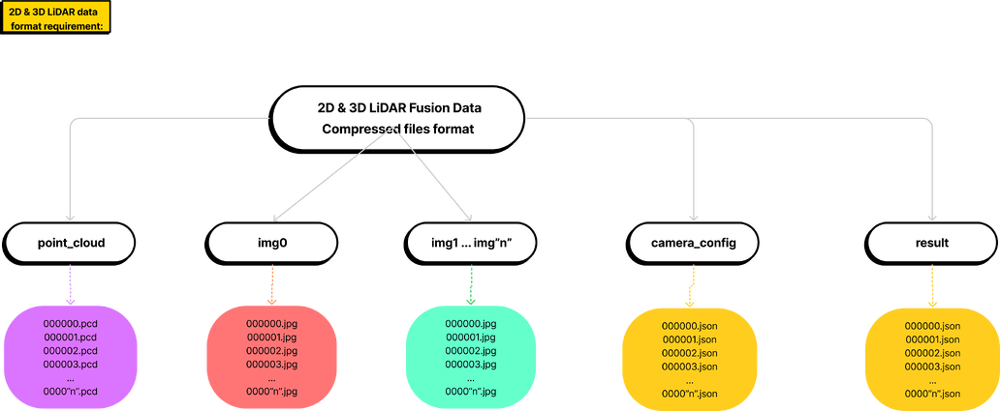
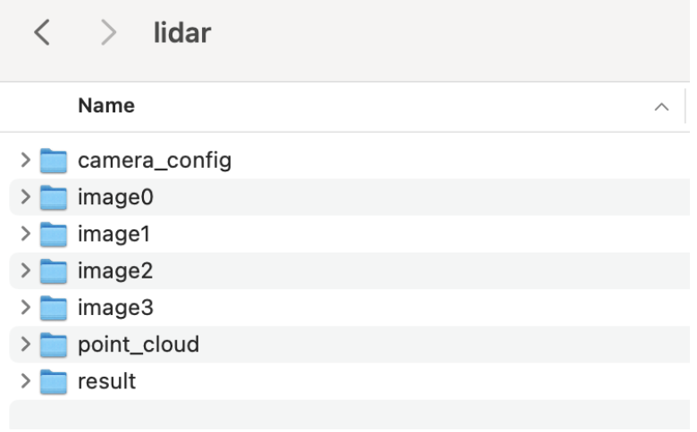

# Upload Dataset

Image, LiDAR and 2D & 3D Fusion LiDAR datasets format requirement

# Dataset Options

Datasets can be uploaded from the **local drive** and through **URLs**.

https://scale.com/docs/uploading-instructions-for-rapid

- Upload from computer
Select files from your computer to upload.

- Upload from CSV
To upload from a local CSV file, you need to include either a column named "attachment_url" or a column named "text". "attachment_url" columns should be the data's publicly accessible remote urls.

"attachment_url"s will be used to fetch the data from that url for a website or file. For websites, the url will be displayed as a link for taskers to open.


## Image Dataset

Data type |  Supported format
:-------------------------:|:-------------------------:
Image data  |  .jpg and .png; Archive file (in .zip, .gzip, .tar format)

If your dataset is not supported or have any problem with importing dataset, contact us in our community.

> The image dataset sample can be downloaded from [here](https://app.box.com/s/hskeiv45ie1q3l6wubte6vaphreh76z3).
> This dataset is provided by [PandaSet](https://pandaset.org/) - a high-quality open-source dataset for autonomous driving.





## LiDAR Dataset (Point cloud)

LiDAR dataset folder must be compressed and placed under the folder **point_cloud** and data must be in **.pcd format**.
 
LiDAR data |  Requirement
:-------------------------:|:-------------------------:
Folder name | point_cloud
File format | .pcd format
Upload file | Archive file (in .zip, .gzip, .tar format)

> The LiDAR dataset sample can be downloaded from [here](https://app.box.com/s/qxqvns8vzhi2w0kt8iladg0nbqp8s1l).
> This dataset is provided by [PandaSet](https://pandaset.org/).

If you don’t see a supported data or file type that you want to upload, contact us in our community.

## 2D & 3D LiDAR Fusion
2D & 3D LiDAR data format requirement:

Folder name | 	Data requirement
:-------------------------:|:-------------------------:
point_cloud | LiDAR data
camera_config | Camera parameter files
image0 | 1st set of image data
image1 | 2nd set of image data
image2 | 3rd set of image data
... | ...
imageN | Nth set of image data

All data must be placed in different folders with the identical file name.


> The 2D & 3D LiDAR Fusion dataset sample can be downloaded from [here](https://app.box.com/s/iuwytq16vakhiy6dlh3uxe4s65s03qu6).
> This dataset is provided by [PandaSet](https://pandaset.org/).


## Structure
2D & 3D LiDAR Fusion dataset

2D & 3D LiDAR Fusion dataset structure
```bash
├── point_cloud
│   ├── 00.pcd
│   ├── 01.pcd
│   ├── 02.pcd
├── image0
│   ├── 00.png
│   ├── 01.png
│   ├── 02.png
├── image1
│   ├── 00.png
│   ├── 01.png
│   ├── 02.png
├── image2
│   ├── 00.png
│   ├── 01.png
│   ├── 02.png
├── camera_config
│   ├── 00.json
│   ├── 01.json
│   ├── 02.json
├── result
│   ├── 00.json
│   ├── 01.json
│   ├── 02.json
```

## Upload Dataset with Pre-annotation Results

LiDAR Basic and 2D & 3D LiDAR Fusion support to upload dataset with pre-annotation results.

All json files must be placed in the **"result"** folder.



The image dataset with pre-annotation result sample file can be downloaded from [here](https://app.box.com/s/hskeiv45ie1q3l6wubte6vaphreh76z3).

The 2D & 3D Fusion dataset with pre-annotation result sample file can be downloaded from [here](https://app.box.com/s/v6tx98f0cm735cyp684tkiplsaezxl1u).

### Dataset License

This dataset is provided by [PandaSet](https://pandaset.org/).
 
If you don’t see a supported data or file type that you want to upload, contact us in the community.

